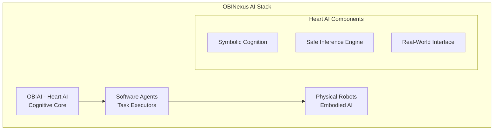
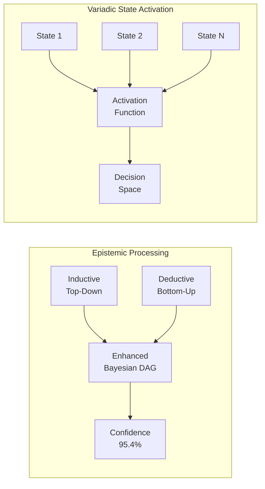
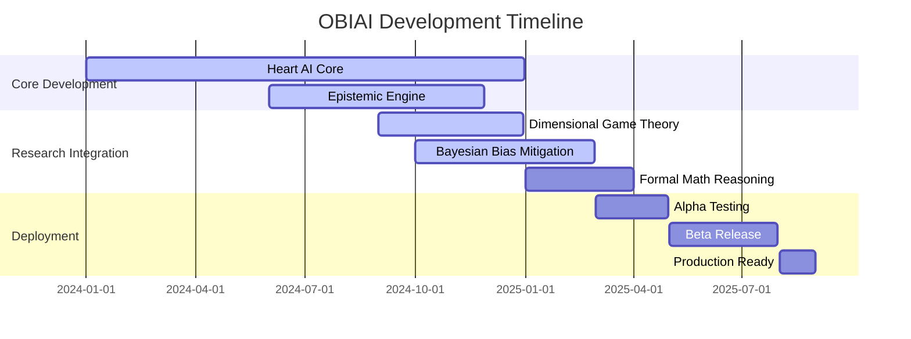

# OBIAI (Ontological Bayesian Intelligence Architecture)
# Living Document – OBIAI, Version 3.2 – Current in Development

## OBIAI: Ontological Bayesian Intelligence Architecture

### Overview

OBIAI is the epistemically validated cognitive core of the OBINexus stack. Inspired by the Igbo concept of "Obi" (the heart), it defines a symbolic, topological, bias-mitigated AI framework capable of real-world deployment across modular robotic, agent, and symbolic systems. It integrates polyglot runtime orchestration, formal bias correction, and zero-overhead computation through obicall and obimarshal, alongside the emerging obiwasm subsystem.

### Core System Modules

#### 1. Heart AI (OBIAI Core)

* **Epistemic Confidence**: Maintains >= 95.4% threshold
* **Bidirectional Reasoning**: Inductive/deductive symbolic logic engine
* **Capsule Cognition**: Verb-noun DAG capsules, topological alignment

#### 2. obicall (Polyglot Runtime)

* Unified runtime across Python, Rust, Go, Node.js, and C
* Dynamically dispatches agents, robotic interfaces, and symbolic engines via `-lobicall.a.so`
* Enforces symbolic safety via cross-language memory and function tracing

#### 3. obimarshal (Shared Utilities and Marshalling)

* Universal marshalling format akin to Python pickle
* Supports browser, robot, and embedded systems for AI model/data syncing
* Enables AI hot-swapping in browser via OBI pickle

#### 4. obiwasm (WASM Runtime Bridge)

* Enables WASM-compatible deployments of OBI agents and symbolic cores
* Shares topology with obimarshal and integrates into web+Android stacks

### Topological Component Model

* **Position-Based Identity**: Not versioned, but logically placed in AI cognitive graph
* **Ship-of-Theseus Compliance**: Components can be updated, replaced, or re-bound while maintaining symbolic coherence if behavior is stable
* **Binding/Driver Decoupling**: Ensures symbolic binding integrity even as drivers change (e.g., hardware upgrades)

### Theoretical Integration

#### A. Dimensional Game Theory (Okpala, 2025)

* Scalar-to-vector transitions in variadic action spaces
* Core to inductive action planning in high-dimensional cognition

#### B. Bayesian Bias Mitigation (Okpala, 2024)

* DAG-based confounder detection
* Real-time causal inference using Pearl's do-calculus

#### C. Mathematical Reasoning Systems (OBINexus)

* Zero-overhead validation using deterministic constraint hashing
* Static to dynamic function translation with compile-time safety

#### D. Secure Thread-Safe Runtime (Gosilang, 2024)

* All multithreaded runtime bindings validated against formal thread safety profiles
* Cross-context validation and lock-free consensus for agent dispatch

#### E. Cryptographic Safety Constraints (OBINexus, 2024)

* SHA256-based memory receipts
* Constraints on heap mutation (epsilon(x) <= 0.6)

### Interfaces

* **OBIVOIP**: Voice interface layer for robotic and software agents
* **OBIROBOT**: Real-time robotic stack with sensory integration and safe actuation
* **OBIAGENT**: Polyglot orchestrator across all supported languages
* **OBIAI Symbolic Core**: Ground truth module for LLM, symbolic cognition, and decision logic

### Patent Clauses (Condensed)

* Cognitive AI with 95.4% validated epistemic threshold
* Real-time symbolic bias correction via DAG+do-calculus
* Zero-overhead marshalling for symbolic AI deployment
* Polyglot runtime (obicall) across 5 languages with symbolic integrity
* Modular topological logic for AI components

### Status

**Document Version**: 3.2  
**Status**: Living Document – Actively Developed  
**Maintainer**: Nnamdi Michael Okpala (OBINexus)  
**Repository**: [github.com/obinexus/obiai](https://github.com/obinexus/obiai)

---

This document shall remain in continuous evolution as theoretical integrations are validated, and deployment environments are expanded (e.g., mobile agents, embodied WASM interfaces, and symbolic serverless cognition).

## The Heart AI - Technical Specification for Patent Filing

**Project Repository**: [https://github.com/obinexus/obiai](https://github.com/obinexus/obiai)  
**OBINexus Computing Platform**: computing.obinexus.org/obiai  
**Document Version**: 3.2  
**Classification**: Patent Technical Specification - Living Document  
**Primary Inventor**: Nnamdi Okpala  
**Status**: Under Active Development  

# Living Document – OBIAI, Version 3.2 – Current in Development

## OBIAI: Ontological Bayesian Intelligence Architecture

> **Development Notice**: OBIAI is under active development. This living technical specification guides engineering implementation and legal protections during system evolution. Architecture and specifications are subject to refinement based on ongoing research and testing.

---

## Executive Summary

OBIAI (Ontological Bayesian Intelligence Architecture), known as the "Heart AI" within the OBINexus ecosystem, represents the cognitive core responsible for symbolic cognition, safe inference, and real-world interaction. The name derives from "Obi" meaning "heart" in Igbo, symbolizing the central life-giving intelligence of the system. This architecture implements cutting-edge research in Dimensional Game Theory for AI (Okpala, 2025), Bayesian Network Bias Mitigation, and Formal Mathematical Function Reasoning to achieve a 95.4% epistemic confidence threshold required for real-world deployment across three evolutionary stages: Core AI → Agents → Robots.

---

## 1. OBIAI as the Heart AI: Cognitive Core Architecture

### 1.1 Foundational Principle



OBIAI serves as the central intelligence system ("Heart") that pumps cognitive capabilities throughout the OBINexus architecture, enabling:
- **Symbolic Cognition**: Processing abstract concepts through verb-noun capsule logic
- **Safe Inference**: Maintaining 95.4% epistemic confidence for critical decisions
- **Real-World Interaction**: Bridging digital reasoning with physical actions

### 1.2 Three-Stage Evolution Model

```python
class OBIAIHeartAI:
    """The Heart AI - Central cognitive system of OBINexus"""
    
    def __init__(self):
        self.stage = "CORE_AI"
        self.epistemic_confidence = 0.0
        self.evolution_path = ["CORE_AI", "AGENTS", "ROBOTS"]
        
    def evolve(self):
        """Evolution across three stages with confidence validation"""
        current_idx = self.evolution_path.index(self.stage)
        
        if self.epistemic_confidence >= 0.954 and current_idx < 2:
            self.stage = self.evolution_path[current_idx + 1]
            return True
        return False
```

---

## 2. Dimensional Game Theory Integration

### 2.1 Multi-Domain Strategic Reasoning

Based on **"Dimensional Game Theory for AI"** (Okpala, 2025), OBIAI implements scalar-to-vector transitions with variadic action spaces:

```python
class DimensionalGameEngine:
    """Implementation of Dimensional Game Theory for strategic reasoning"""
    
    def __init__(self):
        self.scalar_space = RealNumbers()
        self.vector_space = VariadicVectorSpace()
        self.transition_function = ScalarToVectorMap()
        
    def compute_strategy(self, state, action_space):
        """
        Compute optimal strategy using dimensional transitions
        
        Mathematical Framework:
        S: Scalar state representation
        V: Vector space of strategies
        T: S → V (transition function)
        A: Variadic action space
        
        Strategy = argmax_a∈A E[U(T(s), a)]
        """
        scalar_state = self.scalar_space.encode(state)
        vector_strategies = self.transition_function.map(scalar_state)
        
        # Variadic action space allows dynamic dimensionality
        optimal_action = self.optimize_over_variadic_space(
            vector_strategies, 
            action_space
        )
        return optimal_action
```

### 2.2 Mathematical Formalization

```
Game Structure G = (N, S, A, T, U) where:
- N = {1, ..., n} players (agents)
- S = Scalar state space ⊂ ℝ
- A = ∏ᵢ Aᵢ variadic action spaces
- T: S → ℝⁿ transition function
- U: S × A → ℝⁿ utility function

Equilibrium: σ* = Nash(G) s.t. ∀i: Uᵢ(σᵢ*, σ₋ᵢ*) ≥ Uᵢ(σᵢ, σ₋ᵢ*)
```

---

## 3. Bayesian Network Bias Mitigation Architecture

### 3.1 Real-Time DAG Correction

Implementing research from **"Bayesian Network Bias Mitigation in ML Systems"** with confounder modeling:

```python
class BayesianBiasMitigation:
    """Real-time bias correction using Bayesian DAG structures"""
    
    def __init__(self):
        self.dag = BayesianDAG()
        self.confounder_model = ConfounderDetector()
        self.inference_engine = ProbabilisticInference()
        
    def mitigate_bias(self, data_stream):
        """
        Bias mitigation pipeline:
        1. Detect confounders in causal graph
        2. Apply do-calculus for intervention
        3. Correct posterior distributions
        """
        # Identify confounding variables
        confounders = self.confounder_model.detect(data_stream)
        
        # Apply Pearl's do-calculus
        intervened_dag = self.dag.do_intervention(confounders)
        
        # Compute bias-corrected posterior
        P_corrected = self.inference_engine.compute_posterior(
            intervened_dag, 
            data_stream
        )
        
        # Validate epistemic confidence
        confidence = self.compute_epistemic_confidence(P_corrected)
        return P_corrected if confidence >= 0.954 else None
```

### 3.2 Confounder Modeling Framework

```
Causal DAG: G = (V, E) with:
- V = {X, Y, Z, U} where U are unobserved confounders
- E = causal edges

Bias Detection:
B(X→Y) = P(Y|X) - P(Y|do(X))

Correction:
P(Y|do(X)) = ∑_z P(Y|X,Z)P(Z)  [backdoor adjustment]
```

---

## 4. Formal Mathematical Function Reasoning System

### 4.1 Zero-Overhead Marshalling

From **"Formal Math Function Reasoning System"**, implementing deterministic build constraints:

```c
// Zero-overhead function validation with static guarantees
typedef struct {
    FunctionSignature sig;
    ValidationConstraints constraints;
    DeterministicHash hash;
} FormalFunction;

// O(1) validation without runtime overhead
static inline bool validate_function(FormalFunction* f, void* input) {
    // Compile-time constraint checking
    #if defined(STATIC_VALIDATION)
        static_assert(sizeof(input) == f->sig.input_size);
        static_assert(f->constraints.deterministic == true);
    #endif
    
    // Zero-copy validation
    return f->hash == compute_hash_constexpr(input);
}

// Dynamic-to-static function transformation
FormalFunction* transform_dynamic_to_static(DynamicFunction* dyn) {
    FormalFunction* formal = allocate_formal();
    
    // Extract static properties
    formal->sig = analyze_signature(dyn);
    formal->constraints = derive_constraints(dyn);
    formal->hash = compute_deterministic_hash(dyn);
    
    return formal;
}
```

### 4.2 Mathematical Reasoning Framework

```python
class FormalMathReasoning:
    """Formal mathematical function reasoning with proof generation"""
    
    def __init__(self):
        self.proof_engine = TheoremProver()
        self.constraint_solver = Z3Solver()
        
    def validate_function_properties(self, function):
        """
        Validate mathematical properties:
        - Determinism
        - Convergence
        - Bounds
        """
        # Generate formal specification
        spec = self.generate_formal_spec(function)
        
        # Prove determinism
        determinism_proof = self.proof_engine.prove(
            spec.requires_deterministic()
        )
        
        # Verify convergence
        convergence_proof = self.constraint_solver.verify(
            spec.converges_in_finite_time()
        )
        
        return {
            'deterministic': determinism_proof.valid,
            'convergent': convergence_proof.valid,
            'bounds': self.compute_bounds(function)
        }
```

---

## 5. Updated OBIAI Architecture with Epistemic Processing

### 5.1 Bidirectional Epistemic Engine



### 5.2 Implementation Architecture

```python
class OBIAIEpistemicProcessor:
    """Updated epistemic processing with bias mitigation and game theory"""
    
    def __init__(self):
        # Core components
        self.heart_ai = OBIAIHeartAI()
        self.game_engine = DimensionalGameEngine()
        self.bias_mitigator = BayesianBiasMitigation()
        self.math_reasoner = FormalMathReasoning()
        
        # Epistemic components
        self.inductive_engine = InductiveReasoner()
        self.deductive_engine = DeductiveReasoner()
        self.confidence_threshold = 0.954
        
    def process_epistemic_query(self, query, evidence):
        """
        Process query through bidirectional epistemic reasoning
        with real-time bias mitigation
        """
        # Top-down inductive processing
        inductive_hypothesis = self.inductive_engine.generate_hypothesis(query)
        
        # Bottom-up deductive validation
        deductive_validation = self.deductive_engine.validate_against_evidence(
            inductive_hypothesis, 
            evidence
        )
        
        # Apply bias mitigation
        corrected_result = self.bias_mitigator.mitigate_bias(
            deductive_validation
        )
        
        # Game-theoretic strategy selection
        strategy = self.game_engine.compute_strategy(
            corrected_result,
            self.get_action_space()
        )
        
        # Formal validation
        validation = self.math_reasoner.validate_function_properties(strategy)
        
        # Compute final confidence
        confidence = self.compute_aggregate_confidence(
            corrected_result,
            strategy,
            validation
        )
        
        if confidence >= self.confidence_threshold:
            return self.execute_strategy(strategy)
        else:
            return self.request_human_oversight()
```

---

## 6. Real-World Deployment Architecture

### 6.1 Three-Stage Deployment Pipeline

```python
# Stage 1: Core AI (Heart AI)
class CoreAI:
    def __init__(self):
        self.obiai = OBIAIHeartAI()
        self.modules = {
            'consciousness': ConsciousnessModule(),
            'filter_flash': FilterFlashEngine(),
            'dag_validator': BayesianDAGValidator()
        }
        
# Stage 2: Software Agents
class OBIAIAgent(CoreAI):
    def __init__(self, agent_type):
        super().__init__()
        self.capabilities = self.load_agent_capabilities(agent_type)
        self.task_executor = TaskExecutor(self.obiai)
        
# Stage 3: Physical Robots
class OBIAIRobot(OBIAIAgent):
    def __init__(self, robot_config):
        super().__init__("physical_embodiment")
        self.sensors = SensorArray(robot_config)
        self.actuators = ActuatorSystem(robot_config)
        self.safety_override = HumanSafetyOverride()
```

### 6.2 Epistemic Confidence Validation

```
Confidence Computation:
C = w₁·C_game + w₂·C_bias + w₃·C_formal + w₄·C_empirical

Where:
- C_game: Game-theoretic strategy confidence
- C_bias: Bias-corrected posterior confidence  
- C_formal: Formal verification confidence
- C_empirical: Empirical validation score
- Σwᵢ = 1, wᵢ > 0

Deployment Criterion: C ≥ 0.954
```

---

## 7. Development Roadmap and Current Status

### 7.1 Active Development Areas

1. **Dimensional Game Theory Module**: Implementing variadic action spaces
2. **Bayesian Bias Mitigation**: Real-time confounder detection
3. **Formal Reasoning Engine**: Zero-overhead marshalling optimization
4. **Epistemic Validator**: Achieving consistent 95.4% confidence

### 7.2 Integration Timeline



---

## 8. Patent Claims Summary

### 8.1 Primary Claims

1. **Claim 1**: A cognitive AI system termed "Heart AI" implementing bidirectional epistemic reasoning with 95.4% confidence validation
2. **Claim 2**: Integration of Dimensional Game Theory for multi-domain strategic reasoning with scalar-to-vector transitions
3. **Claim 3**: Real-time Bayesian Network bias mitigation with confounder modeling and causal intervention
4. **Claim 4**: Formal mathematical function reasoning with zero-overhead marshalling and dynamic-to-static transformation
5. **Claim 5**: Three-stage evolutionary architecture from Core AI to Physical Robots with consciousness state management
6. **Claim 6**: Variadic state activation for complex decision spaces with epistemic validation

### 8.2 Technical Innovations

- **Heart AI Concept**: Central cognitive system inspired by Igbo concept of "Obi"
- **Dimensional Game Theory**: Novel approach to AI strategic reasoning
- **Real-time Bias Correction**: Bayesian DAG with do-calculus intervention
- **Zero-overhead Validation**: Compile-time constraint checking
- **95.4% Confidence Threshold**: Epistemologically grounded safety metric

---

## 9. References

1. Okpala, N. (2025). "Dimensional Game Theory for AI: Scalar-to-Vector Transitions in Variadic Action Spaces." *OBINexus Research Papers*.

2. Okpala, N. (2024). "Bayesian Network Bias Mitigation in Machine Learning Systems." *Formal Argument for Bias in AI Systems*, OBINexus Computing.

3. Okpala, N. (2024). "Formal Mathematical Function Reasoning System: Zero-Overhead Marshalling and Deterministic Constraints." *OBINexus Technical Reports*.

4. OBINexus Team. (2024). "OBIAI Filter-Flash DAG Cognition Engine v2.2." *Internal Technical Documentation*.

5. Okpala, N. (2024). "Mathematical Framework for Zero-Overhead Data Marshalling for AI." *OBINexus Computing Research*.

---

## 10. Polyglot System Call Runtime (`obicall`)

### 10.1 Architecture Overview

The `obicall` runtime serves as the polymorphic system call interface for all OBINexus functions, providing a unified execution layer that bridges the OBIAI Heart AI with multi-language implementations. Written in C for optimal performance and linked via `-lobicall.a.so`, this runtime enables seamless cross-language communication while maintaining the 95.4% epistemic confidence threshold required for production deployment.

```c
// Core obicall architecture
typedef struct {
    void* topology_manager;      // Layer transition control
    void* context_registry;      // Thread-local execution contexts
    void* syscall_dispatcher;    // Polymorphic function dispatch
    void* validation_engine;     // Epistemic confidence validation
    void* trace_emitter;        // Audit and monitoring
} obicall_runtime_t;

// Initialization
obicall_runtime_t* obicall_init(const char* config_path) {
    obicall_runtime_t* runtime = malloc(sizeof(obicall_runtime_t));
    
    // Initialize topology manager for layer transitions
    runtime->topology_manager = topology_manager_create(config_path);
    
    // Setup syscall abstraction layer
    runtime->syscall_dispatcher = syscall_dispatcher_init();
    
    // Configure epistemic validation
    runtime->validation_engine = validation_engine_create(0.954); // 95.4% threshold
    
    return runtime;
}
```

### 10.2 System Interface Architecture

#### 10.2.1 OBIVOIP (Voice Interface)

The Voice Over IP interface enables cognitive voice processing through the Heart AI:

```c
// OBIVOIP interface definition
typedef struct {
    int (*voice_capture)(audio_buffer_t* buffer);
    int (*voice_synthesis)(const char* text, audio_buffer_t* output);
    int (*cognitive_processing)(audio_buffer_t* input, obiai_response_t* response);
} obivoip_interface_t;

// Register OBIVOIP with obicall
int obicall_register_voip(obicall_runtime_t* runtime, obivoip_interface_t* voip) {
    return syscall_register(runtime->syscall_dispatcher, 
                          "obivoip", 
                          voip, 
                          SYSCALL_TYPE_REALTIME);
}
```

#### 10.2.2 OBIAI (Symbolic Cognition)

Direct integration with the Heart AI's symbolic reasoning engine:

```c
// OBIAI symbolic cognition interface
typedef struct {
    int (*filter_process)(filter_state_t* state, void* input);
    int (*flash_process)(flash_memory_t* memory, void* pattern);
    int (*dag_validate)(bayesian_dag_t* dag, double* confidence);
    int (*epistemic_reason)(query_t* query, evidence_t* evidence, result_t* result);
} obiai_interface_t;

// Bidirectional state synchronization
int obicall_sync_cognitive_state(obicall_runtime_t* runtime, 
                                cognitive_state_t* state) {
    // Validate state transition
    double confidence = validate_state_transition(runtime->validation_engine, state);
    
    if (confidence >= 0.954) {
        return update_global_state(runtime, state);
    }
    return OBICALL_ERROR_LOW_CONFIDENCE;
}
```

#### 10.2.3 OBIROBOT (Robotic Movement & Sensors)

Real-time robotic control with safety guarantees:

```c
// OBIROBOT interface for physical systems
typedef struct {
    // Sensor input processing
    int (*read_sensors)(sensor_array_t* sensors, sensor_data_t* data);
    int (*process_lidar)(lidar_data_t* lidar, obstacle_map_t* map);
    
    // Actuator control
    int (*move_joint)(joint_id_t joint, position_t target, velocity_t max_vel);
    int (*execute_trajectory)(trajectory_t* path, safety_params_t* safety);
    
    // Emergency override
    int (*emergency_stop)(void);
    int (*human_override)(override_command_t* cmd);
} obirobot_interface_t;

// Safe execution wrapper
int obicall_robot_execute(obicall_runtime_t* runtime, 
                         robot_command_t* cmd,
                         safety_context_t* safety) {
    // Epistemic validation before physical action
    if (!validate_robot_action(runtime->validation_engine, cmd, safety)) {
        return OBICALL_ERROR_SAFETY_VIOLATION;
    }
    
    // Execute with trace emission
    trace_emit(runtime->trace_emitter, TRACE_ROBOT_ACTION, cmd);
    return execute_with_monitoring(runtime, cmd);
}
```

#### 10.2.4 OBIAGENT (Language-Level Agent Routines)

Multi-language agent coordination:

```c
// OBIAGENT polyglot interface
typedef struct {
    int (*dispatch_python)(const char* module, const char* function, void* args);
    int (*dispatch_rust)(const char* crate, const char* function, void* args);
    int (*dispatch_go)(const char* package, const char* function, void* args);
    int (*dispatch_nodejs)(const char* module, const char* function, void* args);
} obiagent_interface_t;

// Cross-language orchestration
int obicall_agent_orchestrate(obicall_runtime_t* runtime,
                             orchestration_plan_t* plan) {
    for (int i = 0; i < plan->step_count; i++) {
        orchestration_step_t* step = &plan->steps[i];
        
        // Validate layer transition
        if (!validate_layer_transition(runtime, step->from_layer, step->to_layer)) {
            return OBICALL_ERROR_INVALID_TRANSITION;
        }
        
        // Execute in target language context
        int result = execute_in_layer(runtime, step->to_layer, step->function);
        if (result != OBICALL_SUCCESS) {
            return result;
        }
    }
    return OBICALL_SUCCESS;
}
```

### 10.3 Language Bindings Implementation

#### 10.3.1 Python Integration (`pyobicall`)

```python
# pyobicall - Python binding for obicall runtime
import ctypes
from contextlib import contextmanager
from typing import Any, Callable
import threading

class OBICallRuntime:
    """Python interface to obicall system runtime"""
    
    def __init__(self, config_path: str = "/etc/obicall/config.obicallfile"):
        # Load the shared library
        self.lib = ctypes.CDLL("libobicall.a.so")
        
        # Initialize runtime
        self.runtime = self.lib.obicall_init(config_path.encode())
        self.thread_contexts = threading.local()
        
    @contextmanager
    def cognitive_context(self, context_type: str):
        """Enter a cognitive processing context"""
        # Initialize thread-local context
        thread_id = threading.get_ident()
        context = self.lib.obicall_context_init(self.runtime, thread_id, context_type.encode())
        
        try:
            # Enter cognitive layer
            self.lib.obicall_enter_layer(self.runtime, thread_id, LAYER_PYTHON)
            yield self
        finally:
            # Exit layer and cleanup
            self.lib.obicall_exit_layer(self.runtime, thread_id)
            self.lib.obicall_context_destroy(self.runtime, thread_id)
    
    def call_heart_ai(self, query: str, evidence: dict) -> dict:
        """Direct call to OBIAI Heart AI"""
        with self.cognitive_context("heart_ai_inference"):
            # Prepare query for Heart AI
            query_struct = self._prepare_query(query, evidence)
            
            # Call through obicall
            result = ctypes.POINTER(ResultStruct)()
            status = self.lib.obicall_heart_ai_query(
                self.runtime,
                ctypes.byref(query_struct),
                ctypes.byref(result)
            )
            
            if status == 0:
                return self._parse_result(result)
            else:
                raise RuntimeError(f"Heart AI query failed: {status}")
    
    def robot_command(self, command: str, params: dict) -> bool:
        """Send command to robot through obicall"""
        with self.cognitive_context("robot_control"):
            cmd_struct = self._prepare_robot_command(command, params)
            
            # Validate with epistemic engine
            confidence = ctypes.c_double()
            self.lib.obicall_validate_robot_action(
                self.runtime,
                ctypes.byref(cmd_struct),
                ctypes.byref(confidence)
            )
            
            if confidence.value >= 0.954:
                return self.lib.obicall_robot_execute(
                    self.runtime,
                    ctypes.byref(cmd_struct)
                ) == 0
            else:
                print(f"Action rejected: confidence {confidence.value} < 0.954")
                return False

# Example usage
if __name__ == "__main__":
    # Initialize obicall runtime
    runtime = OBICallRuntime()
    
    # Query Heart AI for decision
    result = runtime.call_heart_ai(
        "Should robot navigate to waypoint?",
        {"obstacles": [], "battery": 0.85, "distance": 10.5}
    )
    
    # Execute robot command if approved
    if result["decision"] == "approved":
        success = runtime.robot_command("navigate", {
            "waypoint": result["waypoint"],
            "max_velocity": 1.0
        })
```

#### 10.3.2 Rust Integration (FFI Bindings)

```rust
// obicall-rs - Rust FFI bindings for obicall
use std::ffi::{CStr, CString};
use std::os::raw::{c_char, c_int, c_void, c_double};

#[repr(C)]
pub struct OBICallRuntime {
    ptr: *mut c_void,
}

#[repr(C)]
pub struct CognitiveQuery {
    query: *const c_char,
    evidence: *const c_void,
    evidence_size: usize,
}

// FFI function declarations
extern "C" {
    fn obicall_init(config_path: *const c_char) -> *mut c_void;
    fn obicall_destroy(runtime: *mut c_void);
    fn obicall_heart_ai_query(
        runtime: *mut c_void,
        query: *const CognitiveQuery,
        result: *mut *mut c_void
    ) -> c_int;
    fn obicall_validate_transition(
        runtime: *mut c_void,
        from_layer: u32,
        to_layer: u32
    ) -> c_int;
}

impl OBICallRuntime {
    /// Initialize obicall runtime
    pub fn new(config_path: &str) -> Result<Self, String> {
        let c_path = CString::new(config_path)
            .map_err(|e| format!("Invalid config path: {}", e))?;
        
        unsafe {
            let ptr = obicall_init(c_path.as_ptr());
            if ptr.is_null() {
                Err("Failed to initialize obicall runtime".to_string())
            } else {
                Ok(OBICallRuntime { ptr })
            }
        }
    }
    
    /// Query the Heart AI through obicall
    pub fn query_heart_ai(&self, query: &str, evidence: &[u8]) -> Result<Vec<u8>, String> {
        let c_query = CString::new(query)
            .map_err(|e| format!("Invalid query: {}", e))?;
        
        let query_struct = CognitiveQuery {
            query: c_query.as_ptr(),
            evidence: evidence.as_ptr() as *const c_void,
            evidence_size: evidence.len(),
        };
        
        unsafe {
            let mut result: *mut c_void = std::ptr::null_mut();
            let status = obicall_heart_ai_query(
                self.ptr,
                &query_struct,
                &mut result
            );
            
            if status == 0 && !result.is_null() {
                // Parse result
                let result_size = *(result as *const usize);
                let result_data = std::slice::from_raw_parts(
                    (result as *const u8).offset(8),
                    result_size
                );
                Ok(result_data.to_vec())
            } else {
                Err(format!("Heart AI query failed with status: {}", status))
            }
        }
    }
    
    /// Validate layer transition
    pub fn validate_transition(&self, from: Layer, to: Layer) -> bool {
        unsafe {
            obicall_validate_transition(self.ptr, from as u32, to as u32) == 0
        }
    }
}

impl Drop for OBICallRuntime {
    fn drop(&mut self) {
        unsafe {
            obicall_destroy(self.ptr);
        }
    }
}

#[derive(Debug, Clone, Copy)]
#[repr(u32)]
pub enum Layer {
    CNative = 0x01,
    Python = 0x02,
    NodeJS = 0x03,
    Go = 0x04,
    Rust = 0x05,
}

// Example usage
fn main() -> Result<(), Box<dyn std::error::Error>> {
    // Initialize runtime
    let runtime = OBICallRuntime::new("/etc/obicall/config.obicallfile")?;
    
    // Validate transition before cross-language call
    if runtime.validate_transition(Layer::Rust, Layer::Python) {
        // Query Heart AI
        let evidence = b"sensor_data: {temp: 23.5, humidity: 45}";
        let result = runtime.query_heart_ai(
            "Analyze environmental conditions",
            evidence
        )?;
        
        println!("Heart AI response: {:?}", String::from_utf8_lossy(&result));
    }
    
    Ok(())
}
```

#### 10.3.3 C Native Example

```c
// Native C example using obicall directly
#include <stdio.h>
#include <stdlib.h>
#include <string.h>
#include "obicall.h"

// Example: Cognitive voice assistant with robot control
int main(int argc, char** argv) {
    // Initialize obicall runtime
    obicall_runtime_t* runtime = obicall_init("/etc/obicall/config.obicallfile");
    if (!runtime) {
        fprintf(stderr, "Failed to initialize obicall runtime\n");
        return 1;
    }
    
    // Initialize thread context
    uint64_t thread_id = pthread_self();
    int result = obicall_context_init(runtime, thread_id, "voice_assistant");
    if (result != OBICALL_SUCCESS) {
        fprintf(stderr, "Failed to initialize context: %d\n", result);
        obicall_destroy(runtime);
        return 1;
    }
    
    // Setup VOIP interface
    obivoip_interface_t voip = {
        .voice_capture = capture_audio_input,
        .voice_synthesis = synthesize_speech,
        .cognitive_processing = process_voice_command
    };
    
    obicall_register_voip(runtime, &voip);
    
    // Main voice assistant loop
    while (1) {
        // Capture voice input
        audio_buffer_t input_buffer;
        if (voip.voice_capture(&input_buffer) == 0) {
            // Process through Heart AI
            obiai_response_t response;
            voip.cognitive_processing(&input_buffer, &response);
            
            // Check if robot action is requested
            if (response.action_type == ACTION_ROBOT_COMMAND) {
                // Validate epistemic confidence
                double confidence;
                obicall_get_confidence(runtime, &response, &confidence);
                
                if (confidence >= 0.954) {
                    // Execute robot command
                    robot_command_t cmd = prepare_robot_command(&response);
                    safety_context_t safety = get_current_safety_context();
                    
                    result = obicall_robot_execute(runtime, &cmd, &safety);
                    if (result == OBICALL_SUCCESS) {
                        printf("Robot command executed successfully\n");
                    } else {
                        printf("Robot command failed: %d\n", result);
                    }
                } else {
                    printf("Action rejected: confidence %.3f < 0.954\n", confidence);
                }
            }
            
            // Synthesize response
            audio_buffer_t output_buffer;
            voip.voice_synthesis(response.text, &output_buffer);
            play_audio(&output_buffer);
        }
        
        // Check for exit command
        if (should_exit()) {
            break;
        }
    }
    
    // Cleanup
    obicall_context_destroy(runtime, thread_id);
    obicall_destroy(runtime);
    
    return 0;
}
```

### 10.4 LLM Core Integration

The `obicall` runtime serves as the symbolic bridge between LLM prompt inputs and system-level actions:

```python
class LLMCoreIntegration:
    """Bridge between LLM cores and obicall system actions"""
    
    def __init__(self, obicall_runtime):
        self.runtime = obicall_runtime
        self.symbol_grounding = SymbolGroundingEngine()
        self.state_manager = BidirectionalStateManager()
        
    def process_llm_output(self, llm_response: str) -> SystemAction:
        """Convert LLM output to grounded system action"""
        # Parse LLM intent
        intent = self.parse_intent(llm_response)
        
        # Ground symbols to system calls
        grounded_action = self.symbol_grounding.ground(intent)
        
        # Validate through obicall
        with self.runtime.cognitive_context("llm_grounding"):
            validation = self.runtime.validate_action(grounded_action)
            
            if validation.confidence >= 0.954:
                # Update bidirectional state
                self.state_manager.update_from_llm(intent, grounded_action)
                
                # Execute through appropriate interface
                return self.execute_grounded_action(grounded_action)
            else:
                return SystemAction.request_clarification(
                    f"Low confidence: {validation.confidence}"
                )
    
    def execute_grounded_action(self, action: GroundedAction) -> SystemAction:
        """Execute grounded action through appropriate obicall interface"""
        if action.domain == "voice":
            return self.runtime.voip_execute(action)
        elif action.domain == "robot":
            return self.runtime.robot_execute(action)
        elif action.domain == "agent":
            return self.runtime.agent_execute(action)
        else:
            return self.runtime.cognitive_execute(action)
    
    def update_llm_context(self, system_state: SystemState):
        """Bidirectional state update back to LLM"""
        # Convert system state to LLM-understandable format
        llm_context = self.state_manager.system_to_llm(system_state)
        
        # Emit trace for audit
        self.runtime.emit_trace("llm_context_update", llm_context)
        
        return llm_context
```

### 10.5 Robotic Reasoning Applications

The `obicall` runtime enables sophisticated robotic reasoning through its unified interface:

#### 10.5.1 Real-Time Actuation and Sensory Input

```c
// Real-time sensor fusion with cognitive processing
typedef struct {
    sensor_data_t* sensor_array;
    size_t sensor_count;
    timestamp_t capture_time;
    epistemic_state_t* epistemic_context;
} sensor_fusion_packet_t;

int obicall_sensor_fusion_cycle(obicall_runtime_t* runtime,
                               sensor_fusion_packet_t* packet) {
    // Capture sensor data with minimal latency
    for (size_t i = 0; i < packet->sensor_count; i++) {
        capture_sensor_atomic(&packet->sensor_array[i]);
    }
    
    // Process through Heart AI with epistemic validation
    cognitive_result_t result;
    int status = obicall_cognitive_process(runtime, 
                                         packet->sensor_array,
                                         packet->sensor_count,
                                         &result);
    
    // Update epistemic state
    update_epistemic_context(packet->epistemic_context, &result);
    
    // Generate actuation commands if confidence threshold met
    if (result.confidence >= 0.954) {
        actuation_plan_t* plan = generate_actuation_plan(&result);
        return execute_actuation_plan(runtime, plan);
    }
    
    return OBICALL_LOW_CONFIDENCE;
}
```

#### 10.5.2 VOIP Cognitive Assistant Integration

```python
class VOIPCognitiveAssistant:
    """Voice-controlled robotic assistant using obicall"""
    
    def __init__(self, obicall_runtime):
        self.runtime = obicall_runtime
        self.voice_buffer = AudioBuffer()
        self.context_memory = ContextualMemory()
        
    async def process_voice_command(self, audio_input: bytes) -> str:
        """Process voice input through cognitive pipeline"""
        # Speech to text
        text = await self.speech_to_text(audio_input)
        
        # Cognitive processing through obicall
        cognitive_response = self.runtime.call_heart_ai(
            text,
            {"context": self.context_memory.get_recent(),
             "audio_features": self.extract_audio_features(audio_input)}
        )
        
        # Execute if action required
        if cognitive_response.get("action_required"):
            action_result = await self.execute_cognitive_action(
                cognitive_response["action"]
            )
            response_text = self.format_action_response(action_result)
        else:
            response_text = cognitive_response["response"]
        
        # Update context memory
        self.context_memory.update(text, response_text)
        
        # Text to speech
        return await self.text_to_speech(response_text)
```

#### 10.5.3 Safe Execution in Embedded Systems

```c
// Embedded system constraints for obicall
#define OBICALL_EMBEDDED_STACK_SIZE    8192
#define OBICALL_EMBEDDED_HEAP_SIZE     65536
#define OBICALL_EMBEDDED_MAX_THREADS   4

// Lightweight embedded configuration
typedef struct {
    size_t stack_size;
    size_t heap_size;
    uint8_t max_concurrent_contexts;
    bool enable_watchdog;
    uint32_t watchdog_timeout_ms;
} obicall_embedded_config_t;

// Initialize for embedded deployment
obicall_runtime_t* obicall_embedded_init(obicall_embedded_config_t* config) {
    // Allocate from static memory pool
    static uint8_t memory_pool[OBICALL_EMBEDDED_HEAP_SIZE];
    static size_t pool_offset = 0;
    
    // Create runtime with constrained resources
    obicall_runtime_t* runtime = (obicall_runtime_t*)&memory_pool[pool_offset];
    pool_offset += sizeof(obicall_runtime_t);
    
    // Initialize with embedded constraints
    runtime->max_contexts = config->max_concurrent_contexts;
    runtime->stack_guard = config->stack_size;
    
    // Setup watchdog for safety
    if (config->enable_watchdog) {
        setup_watchdog_timer(config->watchdog_timeout_ms);
    }
    
    return runtime;
}

// Safe execution wrapper for embedded systems
int obicall_embedded_execute(obicall_runtime_t* runtime,
                            embedded_command_t* cmd) {
    // Check resource constraints
    if (get_free_stack() < runtime->stack_guard) {
        return OBICALL_ERROR_STACK_OVERFLOW;
    }
    
    // Pet watchdog
    reset_watchdog();
    
    // Execute with timeout protection
    return execute_with_timeout(runtime, cmd, EMBEDDED_TIMEOUT_MS);
}
```

### 10.6 Configuration and Deployment

The `obicall` runtime uses a unified configuration format across all deployments:

```toml
# /etc/obicall/config.obicallfile
[runtime]
version = "1.0.0"
epistemic_threshold = 0.954
max_threads = 256
trace_level = "info"

[layers]
enabled = ["c_native", "python", "rust", "go", "nodejs"]
transition_timeout_ms = 1000

[interfaces]
obivoip.enabled = true
obivoip.port = 5060
obiai.enabled = true
obiai.socket = "/var/run/obiai.sock"
obirobot.enabled = true
obirobot.real_time_priority = 99
obiagent.enabled = true
obiagent.max_concurrent = 100

[security]
require_authentication = true
tls_cert = "/etc/obicall/cert.pem"
tls_key = "/etc/obicall/key.pem"
allowed_transitions = [
    ["python", "c_native"],
    ["c_native", "rust"],
    ["rust", "go"],
    ["go", "nodejs"],
    ["nodejs", "python"]
]

[monitoring]
trace_output = "/var/log/obicall/trace.log"
metrics_port = 9090
health_check_interval = 5000
```

### 10.7 Summary

The `obicall` polyglot system call runtime provides the critical infrastructure for the OBIAI Heart AI to interface with real-world systems. Through its unified C API and comprehensive language bindings, it enables:

- **Seamless Cross-Language Execution**: Transparent transitions between Python, Rust, Go, Node.js, and C
- **Epistemic Validation**: Every action validated against the 95.4% confidence threshold
- **Real-Time Performance**: Suitable for robotic control and voice processing
- **LLM Integration**: Symbolic grounding for AI-to-system action translation
- **Safety Guarantees**: Embedded system support with resource constraints
- **Comprehensive Monitoring**: Full trace emission and audit capabilities

This runtime serves as the execution backbone for the entire OBINexus ecosystem, ensuring that the Heart AI's cognitive decisions translate safely and efficiently into real-world actions.

---

## Document Metadata

**Title**: OBIAI Heart AI - Ontological Bayesian Intelligence Architecture  
**Version**: 3.1  
**Date**: January 2025  
**Status**: Living Document - Under Active Development  
**Primary Author**: Nnamdi Okpala  
**Organization**: OBINexus Computing  
**Repository**: https://github.com/obinexus/obiai  
**License**: Patent Pending - OBINexus Computing  
**Contact**: computing.obinexus.org/obiai  

---

## Appendix: Development Disclaimer

This document represents the current state of OBIAI development as a living technical specification. As the Heart AI continues to evolve, architectural decisions and implementation details may be refined based on:

- Ongoing research in Dimensional Game Theory
- Empirical validation of bias mitigation techniques
- Performance optimization of formal reasoning systems
- Real-world deployment feedback
- Integration testing of the obicall runtime across language boundaries


All stakeholders should consider this document as a guide for engineering implementation and legal protection during the active development phase.

---

## 11. Hardware Integration: DIRAM (Directed Instruction RAM)

### 11.1 Overview

The OBIAI Heart AI architecture is designed for seamless integration with advanced hardware memory systems. The reference implementation and future hardware roadmap leverage [DIRAM (Directed Instruction RAM)](https://github.com/obinexus/diram), a cryptographically governed, predictive memory system developed by OBINexus.

**DIRAM** is both a software emulator and a hardware specification for next-generation RAM that:

- **Predicts and pre-allocates memory** for AI workloads using lookahead and asynchronous strategies
- **Enforces zero-trust boundaries** and cryptographic receipts (SHA-256) for every allocation
- **Implements heap event constraints** (ε(x) ≤ 0.6) for runtime governance
- **Supports fork-safe, auditable, and detached execution** for safety-critical and multi-process AI systems
- **Provides a REPL and API for real-time memory introspection and governance**

DIRAM is intended as the physical memory substrate for OBIAI deployments requiring predictive, auditable, and cryptographically secure memory management. The software emulator is available for research and integration, while the hardware specification targets future silicon implementations.

### 11.2 Integration with OBIAI

- **Memory Governance**: OBIAI can leverage DIRAM for predictive allocation, cryptographic audit, and enforcement of memory safety constraints in both software and hardware environments.
- **AI-Optimized Access**: DIRAM's predictive and introspective features are designed to support the high-throughput, low-latency requirements of cognitive AI systems.
- **Security and Traceability**: All memory operations are cryptographically traced, supporting zero-trust and safety-critical use cases in robotics, agents, and embedded AI.
- **Configuration**: DIRAM supports hierarchical configuration and runtime introspection, aligning with OBIAI's requirements for adaptive, self-governing system architectures.


### 11.3 DIRAM Mission and Philosophy

DIRAM is not just a memory manager—it is a vision for predictive, cryptographically-aware, zero-trust RAM that anticipates, governs, and introspects its own state and allocation paths. The mission is to move beyond passive storage to memory that:

- **Looks ahead**: Predictive allocation strategies prepare memory for algorithms before they're called
- **Governs itself**: Enforces cryptographic constraints and zero-trust boundaries at the allocation level
- **Thinks about thinking**: Provides introspective capabilities for AI systems to understand their own memory patterns

DIRAM is currently a software emulator, but the long-term goal is a physical Directed RAM architecture for intelligent, safety-critical systems.

### 11.4 DIRAM Architecture and Features

DIRAM implements a multi-layer memory management system that models future hardware behavior:

```
┌─────────────────────────────────────┐
│     AI Application Layer            │ ← Future: Direct hardware API
├─────────────────────────────────────┤
│   Predictive Allocation Engine      │ ← Future: Hardware accelerated
│  (Promises & Lookahead Cache)       │
├─────────────────────────────────────┤
│    Enhanced Feature Allocation      │
│  (Error Indexing & Governance)      │
├─────────────────────────────────────┤
│      Core Traced Allocation         │ ← Future: On-chip SHA engine
│    (SHA-256 Receipt Generation)     │
├─────────────────────────────────────┤
│      Heap Event Constraints         │ ← Future: Hardware enforced
│        (ε(x) ≤ 0.6 Enforcement)     │
└─────────────────────────────────────┘
         ↓
    [Future Hardware Layer]
```

**Key Features:**
- Cryptographic memory tracing (SHA-256 receipts)
- Predictive allocation and lookahead caching
- Heap constraint enforcement (ε(x) ≤ 0.6)
- Zero-trust memory boundaries and audit trails
- Fork-safe, detached execution and REPL for live introspection
- Hardware vision: on-chip cryptographic engines, predictive cache, and AI-optimized access

### 11.5 Why DIRAM Matters for OBIAI

Current RAM does not understand what it stores, nor does it enforce memory integrity or predict future access patterns. DIRAM proposes a new direction where memory takes agency—allocation becomes audit, and RAM is predictive, not passive.

For OBIAI, this means:
- **Safety and Trust**: Memory operations are cryptographically validated and auditable
- **Performance**: Predictive allocation and AI-optimized access patterns reduce latency for cognitive workloads
- **Security**: Zero-trust boundaries and fork safety protect against unauthorized access and memory corruption
- **Future-Proofing**: The architecture is designed for both software emulation and future silicon, ensuring OBIAI can scale from research to production hardware

For full technical details, see the [DIRAM repository](https://github.com/obinexus/diram) and the included documentation for configuration, usage, and hardware vision.

---

---


**END OF DOCUMENT**