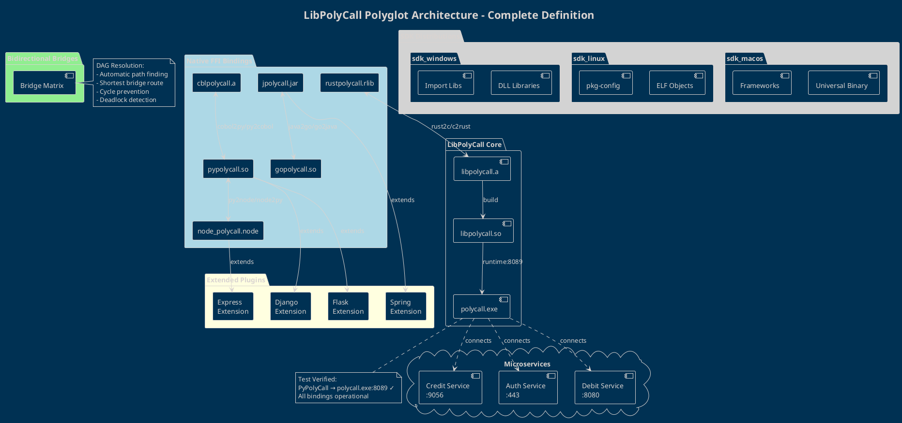
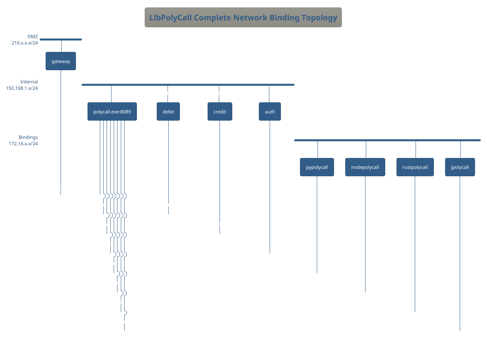

## LibPolyCall Architecture Definition Document

### Core Architecture Components

#### 1. Native FFI Bindings (Square Pattern)
Pure language bindings providing direct FFI access to libpolycall core.

```markdown
## Native Bindings
- **pypolycall.so** - Python ctypes binding
- **node_polycall.node** - Node.js N-API binding  
- **jpolycall.jar** - Java JNI binding
- **cblpolycall.a** - COBOL-C binding
- **gopolycall.so** - Go CGO binding
- **rustpolycall.rlib** - Rust FFI binding

### Characteristics:
- Equal responsibility all sides
- Direct memory mapping
- Zero overhead communication
- Thread-safe by design
```

#### 2. Bidirectional Bridges

```markdown
## Bidirectional Bridge Pattern
Bridge naming: `{source}polycall2{target}`

### Active Bridges:
- **pypolycall2node** ↔ **nodepolycall2python**
- **rustpolycall2c** ↔ **cpolycall2rust**  
- **java2go** ↔ **go2java**
- **cobol2python** ↔ **python2cobol**

### Bridge Protocol:
1. Source language marshals data
2. libpolycall transports (no logic)
3. Target language unmarshals
4. Response follows reverse path
```

#### 3. Plugin Extensions (Rectangle Pattern)

```markdown
## Extended Plugins
Framework-specific extensions adding features beyond pure binding.

### Web Framework Plugins:
- **Django Extension** - WSGI integration
- **Flask Extension** - Werkzeug hooks
- **Spring Extension** - Bean management
- **Express Extension** - Middleware chain

### Characteristics:
- More features on app side
- Framework-specific optimizations
- Maintains pure core separation
```

#### 4. SDK (Software Development Kit)

```markdown
## Platform SDKs

### SDK Components:
```yaml
sdk_{platform}/:
  bindings/:       # All language bindings
    - libpolycall.{ext}
    - pypolycall.so
    - nodepolycall.node
  headers/:        # C/C++ headers
    - polycall.h
    - polycall_ffi.h
  docs/:           # Platform-specific docs
    - quickstart.md
    - api_reference.md
  examples/:       # Sample code
    - banking_service/
    - auth_service/
  tools/:          # Build tools
    - cmake/
    - pkg-config/
```

### Platform Targets:
- **sdk_macos** - Universal binary (arm64 + x86_64)
- **sdk_linux** - ELF shared objects
- **sdk_windows** - DLL + import libs
```

### PlantUML Architecture Diagram



### DAG (Directed Acyclic Graph) Plugin Resolution

```plantuml
@startuml
!theme cerulean
title Plugin Resolution via DAG

digraph plugins {
  rankdir=LR
  
  subgraph cluster_source {
    label="Source Language"
    python [shape=box]
    node_js [shape=box]
    rust [shape=box]
  }
  
  subgraph cluster_bridge {
    label="Bridge Layer"
    style=filled
    color=lightgrey
    
    py_binding [label="pypolycall"]
    node_binding [label="nodepolycall"]
    rust_binding [label="rustpolycall"]
    
    resolver [shape=diamond, label="DAG\nResolver"]
  }
  
  subgraph cluster_target {
    label="Target Service"
    service_a [shape=box3d]
    service_b [shape=box3d]
    service_c [shape=box3d]
  }
  
  python -> py_binding
  node_js -> node_binding
  rust -> rust_binding
  
  py_binding -> resolver
  node_binding -> resolver
  rust_binding -> resolver
  
  resolver -> service_a [label="shortest path"]
  resolver -> service_b [label="no cycles"]
  resolver -> service_c [label="thread-safe"]
}

note right : "DAG ensures no circular\ndependencies in plugin\nresolution chain"

@enduml
```

### Complete Network Topology



### Key Architectural Principles

1. **Pure Separation**: libpolycall core contains NO business logic
2. **Universal FFI**: Every language gets equal treatment
3. **Bidirectional Freedom**: Any language can call any other
4. **Plugin Extensions**: Framework-specific features don't contaminate core
5. **SDK Completeness**: Each platform gets full toolkit
6. **DAG Resolution**: No circular dependencies allowed
7. **Thread Safety**: All bindings are thread-safe by design

This architecture enables true polyglot microservices where each service can be written in the optimal language while maintaining complete interoperability through libpolycall's pure communication layer.