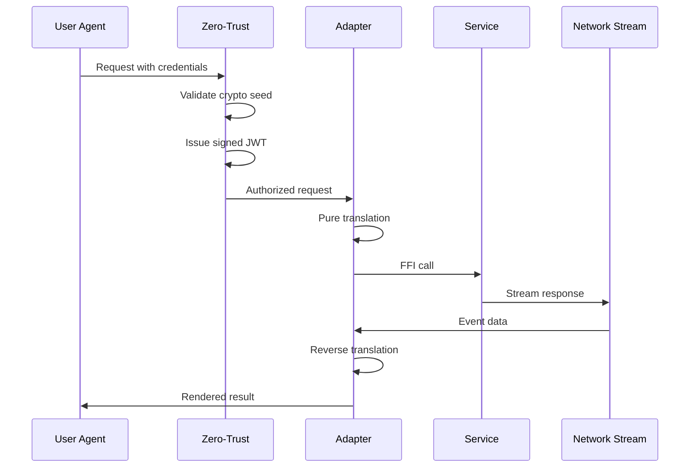

# Web PolyCall Integration Guide
## Zero-Trust Polyglot Service Architecture

### Version 3.0.0 | OBINexus libpolycall

---

## Architecture Overview

The Web PolyCall system creates a seamless communication protocol over polyglot services, where everything is served via HTTPS layers with zero-trust security. User agents (REPL terminals) consume APIs through adapter interfaces that ensure pure, stateless translation.

---

## Core Components Integration

### 1. User Agent as REPL Terminal

```bash
# User interacts via shell agent REPL
$ polycall connect --adapter python --zero-trust
Connected to polycall.obinexus.org
Token issued: eyJ0eXAiOiJKV1QiLCJhbGc...

# Execute adapter calls directly
$ polycall exec banking.debit.validate --amount 100.00
✓ Validation passed via Rust adapter
✓ Zero-trust verification complete

# Stream documents through pipeline
$ polycall stream doc.image.process < image.jpg
✓ Image processed via Python adapter
✓ Output: image_processed.webp
```

### 2. Adapter Interface Flow

```python
# Example: Python adapter consuming web service
from obinexus.polycall import WebAdapter, ZeroTrust

class DocumentAdapter(WebAdapter):
    """Pure translation adapter for documents"""
    
    def translate(self, doc_input):
        # Pure translation - no business logic
        return {
            'mime_type': self.detect_mime(doc_input),
            'content': self.to_ffi_value(doc_input),
            'metadata': self.extract_metadata(doc_input)
        }
    
    def reverse(self, ffi_output):
        # Bidirectional safety
        return self.from_ffi_value(ffi_output)
```

### 3. Path Service Action Mapping

The `polycall.xml` defines how paths map to services and trigger code loading:

```yaml
Path: /api/v2/banking/debit/validate
  ↓
Service: banking-service:8080
  ↓
Module: libpolycall_banking.so (lazy loaded)
  ↓
Adapter: Rust (hot-swappable)
  ↓
Action: debit.validate
```

### 4. Zero-Trust Composition Flow



---

## Implementation Examples

### Example 1: Document Processing via Shell Agent

```bash
#!/bin/bash
# shell_agent.sh - Document processing pipeline

# Initialize zero-trust session
export POLYCALL_TOKEN=$(polycall auth --seed $CRYPTO_SEED)

# Process ZIP archive with streaming
polycall process \
  --adapter go \
  --service documents:9090 \
  --action archive.extract \
  --stream \
  < archive.zip \
  | polycall transform \
    --adapter python \
    --action image.compress \
  > processed_output/
```

### Example 2: Web Service Registration

```javascript
// Node.js adapter registering web service
const { PolyCall, WebService } = require('@obinexus/polycall');

const service = new WebService({
  id: 'analytics',
  port: 8443,
  basePath: '/api/v2/analytics',
  
  operations: [
    {
      path: '/metrics/*',
      method: 'GET',
      adapter: 'rust',
      action: 'metrics.collect',
      cache: { ttl: 60 }
    }
  ],
  
  zeroTrust: {
    required: true,
    policy: 'strict'
  }
});

// Register with hot-swap capability
PolyCall.register(service, { hotSwap: true });
```

### Example 3: Network Stream Connection

```rust
// Rust adapter consuming network streams
use obinexus_polycall::{StreamConnect, EventBus};

impl StreamAdapter {
    fn connect_stream(&self) -> Result<Stream> {
        let stream = StreamConnect::new()
            .endpoint("wss://ws.polycall.obinexus.org")
            .channel("service.*")
            .heartbeat(30000)
            .connect()?;
        
        // Pure event translation
        stream.on_event(|event| {
            let ffi_event = self.translate(event);
            self.emit(ffi_event)
        });
        
        Ok(stream)
    }
}
```

---

## Path Service Actions

### Code Loading Strategy

```xml
<!-- From polycall.xml -->
<web:code-loading>
    <web:strategy>lazy</web:strategy>
    <web:cache-compiled>true</web:cache-compiled>
    <web:hot-reload>enabled</web:hot-reload>
</web:code-loading>
```

This ensures:
1. **Lazy Loading**: Modules load only when needed
2. **Compiled Cache**: Reuse compiled modules
3. **Hot Reload**: Update without restart

### Route Resolution

```
User Request: GET /api/v2/docs/pdf/report.pdf
     ↓
Path Mapper: Match pattern /api/v2/docs/**
     ↓
Target: document-service:9090
     ↓
Load Module: libpolycall_docs.so
     ↓
Adapter: node (for PDF processing)
     ↓
Action: pdf.process
     ↓
Stream: Response via SSE/WebSocket
```

---

## Security Model

### Zero-Trust Verification Flow

1. **Every Request**: Validated against policy
2. **Crypto Seed**: Rotates every 3600 seconds
3. **JWT Token**: 15-minute expiry with 5-minute refresh
4. **Adapter Calls**: Pure functions, no state
5. **Network Streams**: TLS 1.3 with certificate pinning

---

## API Documentation Access

The system auto-generates OpenAPI documentation:

```bash
# Access interactive API docs
curl https://api.polycall.obinexus.org/api/docs

# Get OpenAPI spec
curl https://api.polycall.obinexus.org/api/docs/openapi.json

# Example for each language
curl https://api.polycall.obinexus.org/api/docs/examples/python
```

---

## Monitoring & Telemetry

```yaml
# Real-time metrics
GET /metrics
# Returns Prometheus format

# Distributed tracing
POST /trace
# Sends to Jaeger

# Structured logging
{
  "timestamp": "2025-01-30T12:00:00Z",
  "level": "info",
  "correlation_id": "abc-123",
  "service": "banking",
  "adapter": "rust",
  "action": "debit.validate",
  "duration_ms": 45
}
```

---

## Quick Start Commands

```bash
# 1. Initialize polycall with zero-trust
polycall init --zero-trust --config polycall.xml

# 2. Start user agent REPL
polycall repl --shell bash --adapter all

# 3. Test banking service
polycall test banking.debit.validate \
  --data '{"amount": 100, "account": "12345"}'

# 4. Stream documents
cat document.pdf | polycall stream doc.pdf.process

# 5. Monitor services
polycall monitor --services all --format json

# 6. Hot-swap adapter
polycall swap --adapter python --version 2.1.0
```

---

## Integration Checklist

- [ ] Configure `polycall.xml` with service mappings
- [ ] Deploy adapters for each language
- [ ] Enable zero-trust composition
- [ ] Set up network stream endpoints
- [ ] Configure path-to-service routing
- [ ] Enable code lazy loading
- [ ] Set up monitoring/telemetry
- [ ] Generate API documentation
- [ ] Test bidirectional translations
- [ ] Verify hot-swap capability

---

## Summary

The Web PolyCall architecture provides:

1. **Seamless Communication**: Via HTTPS with WebSocket/SSE/gRPC streams
2. **Zero-Trust Security**: Every call validated with crypto-signed tokens
3. **Polyglot Support**: Pure adapter translations for any language
4. **Document Processing**: Images, PDFs, ZIPs via streaming pipelines
5. **Hot-Swappable**: Update adapters without downtime
6. **Path Mapping**: Automatic service routing and code loading
7. **User Agent REPL**: Shell-based interaction with all services

The system ensures that adapters remain **invisible glue** - pure translators that never leak implementation details or contain business logic, maintaining the OBINexus philosophy of "Computing from the Heart."